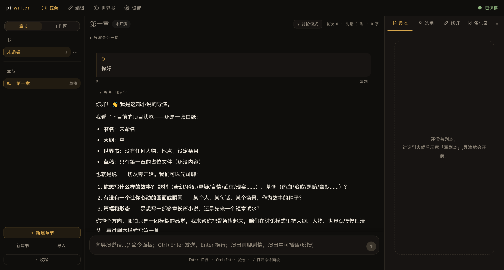
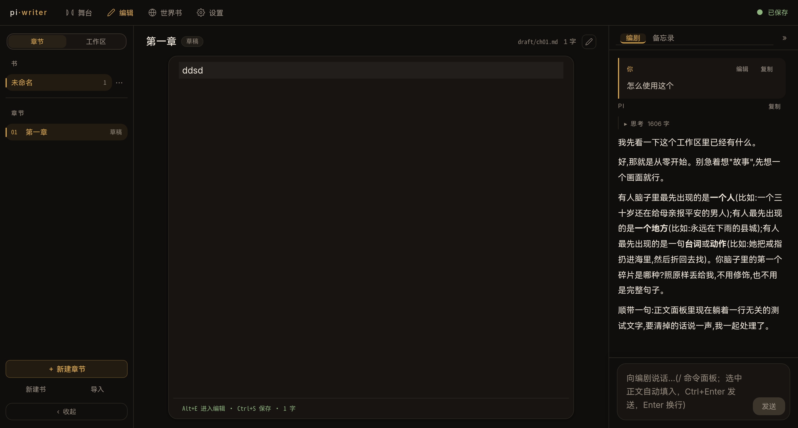
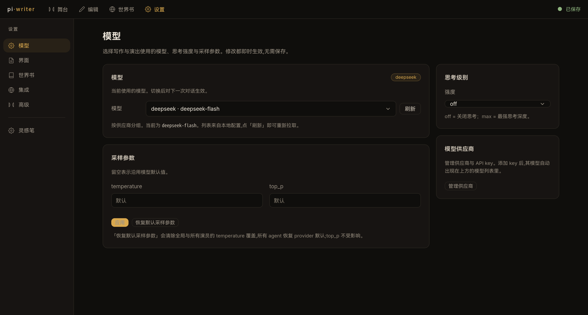

#  pi-writer

AI 原生的长篇创作环境——基于 [Pi](https://pi.dev) 框架,让作者与 Agent 在一部**持续存在的世界里**协作完成长篇创作:章节、人物、世界观、关系网、跨章记忆,都由系统与 Agent 共同维护。

**当前状态:实验性项目。** 架构仍在演化,开发中可能发生破坏性变更。

## 界面预览








ps:这是vibe coding出来的，所以不要期待代码质量很高，但是！！！我会人为控制的 (绝对会！！！)

## 为什么需要 pi-writer?

首先,这很好玩（真的！！！）,pi-wrier在维持剧情稳定上，有一定约束，但一定程度借鉴了酒馆的工程实践，结合了角色扮演的经验。


- **一致的人物**——性格、口吻、成长轨迹不漂移;
- **稳定的世界规则**——设定不吃书;
- **清晰的时间线**——事件顺序不乱;
- **跨章节的长期记忆**

pi-writer 探索的是:**Agent 如何在一个持续存在的创作世界里工作**。

## 三大核心

### 1. 持久的世界(Persistent World)

`world.json` 是世界唯一真相源:人物 / 世界观 / 时间线 / 大纲条目、关系网(可标记强关联)、写作约束、文风采样、发展线、时间线事件、简要世界观概述。Agent 通过结构化工具(`world_update`)维护它,界面与导出视图由它生成——**世界不随对话结束而消失**。

### 2. 章节即会话(Chapter-based Agent)

每一章 = 一个独立的 Agent 会话 + 一份草稿文件。上下文按章节隔离:本章草稿、相关世界设定、跨章记忆按预算注入;切章即切换工作现场,各章历史互不串扰。会话支持撤回、编辑重发与分支切换。

### 3. 创作工作流(Creative Workflow)（这是特色，重点看！）

- **上下文激活引擎**:只注入「当前相关」的内容——关键词命中 + 强关联展开,预算内按优先级排序,保持前缀稳定以降低成本;
- **常驻记忆**:跨章记忆(约 1500 token),Agent 章节收尾自主维护;
- **世界书变更预览**:Agent 更新世界时,前端弹出 diff 预览卡,作者确认后再归档;
- **舞台区(实验)**:导演 / 演员 / 编剧多 Agent 共演——导演维护世界书、提交剧本**经作者卡片确认**后开演,演员在共享舞台即兴共演,编剧收幕成文。（特色的特色，绝对有意思！！！你一定要试试）

## 能力一览

| 能力 | 说明 |
|------|------|
| 三种界面,一份数据 | 全屏 TUI / 本地 Web GUI(默认 `127.0.0.1:8811`)/ Electron 桌面壳,共用 `~/.pi/writer` 数据,可并行运行 （真的有人用TUI吗🤔）|
| 结构化的世界管理 | `world_update` 结构化更新(条目 / 关系 / 约束 / 发展线 / 时间线 / 采样 / 世界观概述),`world_find` 只读检索;详细操作见 [docs/architecture.md](docs/architecture.md) |
| 上下文激活引擎 | 关键词命中 + 关联激活(深度内多源 BFS、强关联优先),预算内注入 |
| 内置编辑器 | TUI 全屏编辑器(vim 可选)+ Web CodeMirror 6(正文常驻 + 右栏对话) |
| 关系图 | 人物 / 世界关系图,布局与视口持久化,可标记强关联 |
| 写作技能 | `outline` / `critique` / `revise` / `stage-scripting` |
| 分支会话 | 章节会话支持撤回、编辑重发、分支切换 |
| MCP 扩展 | 通过 Model Context Protocol 接入外部工具(stdio / http / sse) |

## 基于 Pi 构建

[Pi](https://pi.dev) 提供 Agent 运行时(会话、工具、事件、MCP)。pi-writer 在其上增加:

- 面向写作的工具集(`world_update` / `world_find` / `word_count`);
- 世界状态管理(`world.json` 单一真相源 + 校验 / 原子写 / 视图导出);
- 长篇记忆(跨章节 `memory.md`);
- 创作工作流(背景包注入、预览卡、舞台共演)。

pi-writer所有配置独立存放于 `~/.pi/writer`,不读取 Pi coding-agent 的配置。

## 快速开始

```bash
# 安装依赖
npm install

# TUI:新建一本书
npx tsx src/cli.ts --new-book "我的小说"

# TUI:打开已有书
npx tsx src/cli.ts --book my-novel

# Web GUI(默认 http://127.0.0.1:8811,自动开浏览器)
npx tsx src/cli.ts --web

# Web GUI:Electron 桌面壳
npm run build:web && npm run electron
```

要求:Node.js ≥ 18.20.4;`npm run bundle`(TUI 单文件可执行)与 `npm run build:electron` 需要 [bun](https://bun.sh)。

## 文档

- [docs/architecture.md](docs/architecture.md) — 架构总览(模块、数据流、事件链)
- [docs/development.md](docs/development.md) — 开发指南(运行 / 测试 / 构建 / 约定)
- [docs/security.md](docs/security.md) — 安全模型(工具守卫、服务端防护)
- [docs/design.md](docs/design.md) — 设计文档(核心决策与取舍)

## Roadmap

- [x] 章节会话管理(独立上下文、分支、撤回)
- [x] 世界书系统(`world.json` + 关系图 + 约束 / 采样 / 发展线)
- [x] Web 写作工作台(深夜书房:书库 / 纸张 / AI 伙伴)
- [x] 上下文激活引擎(关键词命中 + 关联激活 + 预算排序)
- [x] 常驻世界观概述(`worldSummary`)
- [x] 世界书变更预览卡
- [x] 舞台多 Agent 共演(实验:导演 / 演员 / 编剧)
- [ ] 关联激活进阶(多主题保底、深度配置化、预算比例制)
- [ ] 记忆管理增强
- [ ] 不知道多少的未知bug


## License 与致谢

MIT License,Copyright (c) 2026 Eicbro3ding。

基于 [Pi](https://pi.dev) 构建。部分组件衍生自 Pi,保留其原始许可证。
